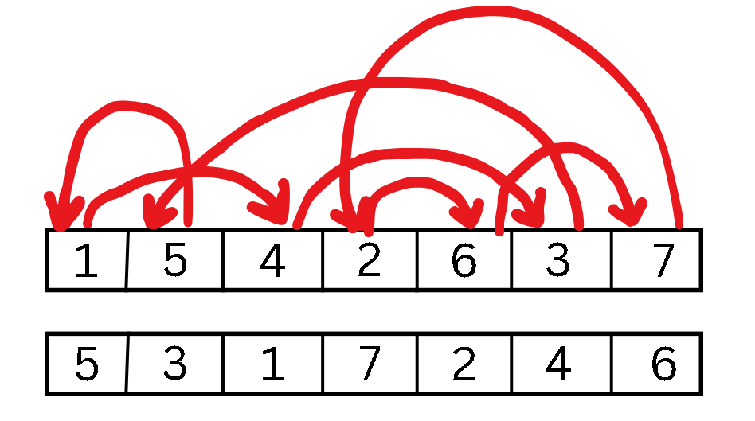
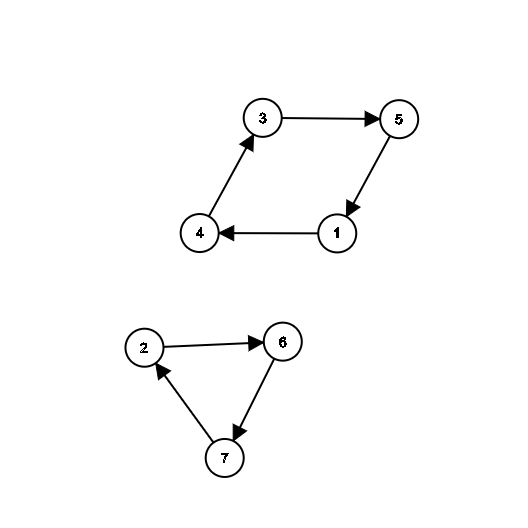

> **Given two permutations of $[1...n]$, say $\pi_1(n)$ and $\pi_2(n)$, find the minimum number of swaps required to get from $\pi_1$ to $\pi_2$.**

This is the easier version of the problem, since all the elements are guaranteed to be distinct. To go from $\pi_1$ to $\pi_2$, the $i$-th element of $\pi_1$ needs to go from its position $i$ in $\pi_1$ to a new position $j_i$ in $\pi_2$. It somewhat looks like this:

  

This looks somewhat like a graph! When we untangle this gnarly mess and straighten out the curves, this is what we get:

  

This graph is special: each node has exactly one outdegree and one indegree. We note that such a graph will be composed entirely of loops, considering also singleton nodes with self-loops, if any.

> **Theorem: Consider a digraph $G$ with $n$ nodes. If each node $i \in V_G$ has exactly one outdegree and one indegree, then $G$ consists entirely of disjoint cycles, including self-loops.**
>
> **Proof:**  The idea that permutations can be decomposed into disjoint cycles comes from group theory. For more, see [Permutation Graph](https://en.wikipedia.org/wiki/Permutation_graph). For a proof of the theorem, look at [this Math SE answer](https://math.stackexchange.com/a/2478207/1062486).

Now if we swap two non-consecutive elements in the graph, we simply swap the two nodes and nothing else happens. But if we swap two consecutive elements, say $1$ and $5$, then $5$ goes to the place it wanted to go, and gets out of the graph, with its out-degree pointing to itself. On the other hand, the place where $3$ wanted to go, earlier occupied by $5$, is now occupied by $1$ and so the outdegree of $3$ is directed towards $1$. Thus, in a cycle of size $k$, each swap of consecutive elements reduces the cycle length by $1$ by putting one element (the one in the pair from which the outdegree emanates) in the correct place, except when $k=2$ when it puts both the elements in their correct place. So to demolish a cycle of length $k$, we need exactly $k - 1$ swaps.

Thus, if the total number of nodes in the graph is $n$ and the total number of disjoint connected components is $c$, then the minimum number of swaps needed is $$\sum_{C \text{is a connected component}}(\text{\# of nodes in C} - 1) = n - c$$

One special case to consider is that of the positions which are already in place, i.e. $i = j_i$. These will be represented in the graph by nodes which have self-loops and no outside connections, thus forming a singleton. Of course, involving these in a swap can never be optimal, since we will have to again waste a swap operation to bring it back to the correct place. These will, notably, not disturb the formula since we need $1-1=0$ swaps to put it to its correct place.

Thus the final algorithm to find the minimum number of swaps for two given permutations as input is:

>1. Convert the transformation from permutation $\pi_1$ to $\pi_2$ into a permutation graph
>2. Find the number of connected components in the graph via a standard algorithm (such as DFS), say it is k.
>3. The answer is $n - k$.

Now, sitting in the returning office cab and looking at [this video](https://www.youtube.com/watch?v=vfsrJB_yfo0), my mind immediately spawns the following problem:

> **Given two permutations of $[1...n]$, say $\pi_1(n)$ and $\pi_2(n)$, let $f(\pi_1, \pi_2)$ be the minimum number of swaps required to get from $\pi_1$ to $\pi_2$. Find $\mathbb E[f(\pi_1, \pi_2)]$ where $\pi_1(n)$ and $\pi_2(n)$ are sampled uniformly from the set of $n!$ permutations of $[1...n]$.**

A few great takes on this puzzle can be found [here](https://math.stackexchange.com/q/165407/1062486).

